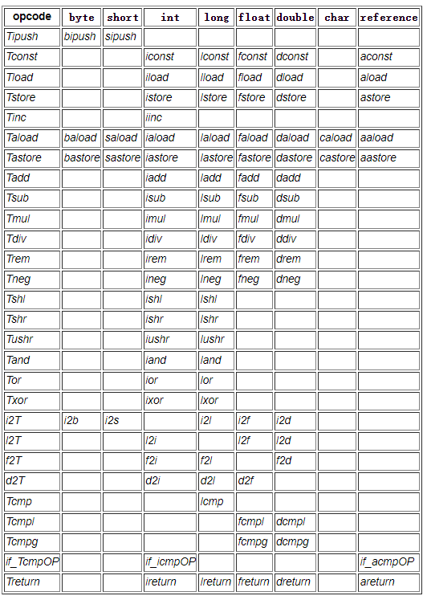
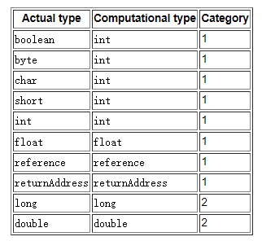

Java虚拟机指令由一个指定要执行的操作的一字节操作码组成，后面跟着零个或多个操作数，提供操作使用的参数或数据。许多指令没有操作数，只由一个操作码组成。

忽略异常，Java虚拟机解释器的内部循环是有效的

`java`

```
do {
    atomically calculate pc and fetch opcode at pc;
    if (operands) fetch operands;
    execute the action for the opcode;
} while (there is more to do);
```

操作数的数量和大小由操作码决定。如果操作数的大小大于一个字节，则按大端顺序存储——高序字节优先。例如，到局部变量的无符号16位索引被存储为两个无符号字节，byte1和byte2，因此其值为(byte1 << 8) | byte2。

字节码指令流只是单字节对齐。两个例外是lookupswitch和tableswitch指令(§lookupswitch，§tableswitch)，它们被填充以强制在4字节边界上对某些操作数进行内部对齐。

将Java虚拟机操作码限制为一个字节并放弃编译代码中的数据对齐的决定反映了对紧凑性的有意识偏好，这可能以在幼稚实现中牺牲一些性能为代价。一个字节的操作码也限制了指令集的大小。不假设数据对齐意味着必须在许多机器的运行时从字节构造大于一个字节的即时数据。

### 2.11.1. Types and the Java Virtual Machine类型和Java虚拟机
Java虚拟机指令集中的大多数指令都对它们执行的操作的类型信息进行编码。例如，加载指令(§ilload)将局部变量的内容加载到操作数堆栈中，该局部变量必须是int型。load指令(§load)对浮点值做同样的操作。这两个指令可能具有相同的实现，但具有不同的操作码。

对于大多数类型指令，指令类型在操作码助记符中用字母显式表示:i表示int操作，l表示long操作，s表示short操作，b表示byte操作，c表示char操作，f表示float操作，d表示double操作，a表示reference操作。某些类型明确的指令在助记符中没有类型字母。例如，arraylength总是对数组对象进行操作。一些指令，如goto，一个无条件的控制转移，不操作类型化的操作数。

由于Java虚拟机的操作码大小为1字节，因此将类型编码为操作码会给其指令集的设计带来压力。如果每个类型化指令都支持所有Java虚拟机的运行时数据类型，那么指令的数量将超过一个字节所能表示的数量。相反，Java虚拟机的指令集为某些操作提供了较低级别的类型支持。换句话说，指令集故意不是正交的。根据需要，可以使用单独的指令在不支持和支持的数据类型之间进行转换。

表2.11.1-A总结了Java虚拟机指令集中的类型支持。通过将指令模板中的操作码列中的T替换为类型列中的字母，构建具有类型信息的特定指令。如果某些指令模板和类型的type列为空，则不存在支持该操作类型的指令。例如，有一个int类型的加载指令ilload，但是没有一个byte类型的加载指令。

注意，表2.11.1-A中的大多数指令都没有整型byte、char和short的形式。它们都没有布尔类型的表单。编译器使用Java虚拟机指令对字节和短类型的文字值进行编码，这些指令在编译时或运行时将这些值符号扩展为int类型的值。布尔类型和char类型的文字值的加载是使用在编译时或运行时将文字零扩展为int类型的指令进行编码的。同样地，从布尔类型、字节类型、短类型和char类型的值的数组中加载的数据也使用Java Virtual Machine指令进行编码，这些指令将值进行符号扩展或零扩展，以转换为int类型的值。因此，对布尔型、字节型、char型和short型实际类型的值的大多数操作，都可以由对计算型int型值进行操作的指令正确执行。

Table 2.11.1-A. Type support in the Java Virtual Machine instruction set 在Java虚拟机指令集中键入支持

Java虚拟机实际类型与Java虚拟机计算类型的对应关系如表2.11.1-B所示。

某些Java虚拟机指令，如pop和swap，在操作数堆栈上操作而不考虑类型;然而，这些指令被限制只能用于计算类型的某些类别的值，如表2.11.1-B所示。

表2.11.1-B.Java虚拟机中的实际类型和计算类型



### 2.11.2.  Load and Store Instructions加载和存储指令
load和store指令在Java虚拟机框架(2.6)的局部变量(2.6.1)和操作数栈(2.6.2)之间传递值:

将一个局部变量加载到操作数堆栈:Load, iload_<n>， lload, lload_<n>， Load, fload_<n>， dload, dload_<n>， Load, aload_<n>。

将操作数堆栈中的值存储到一个局部变量中:istore, istore_<n>， lstore, lstore_<n>， fstore, fstore_<n>， dstore, dstore_<n>， astore, astore_<n>。

将常量加载到操作数堆栈:bipush、sipush、ldc、ldc_w、ldc2_w、aconst_null、iconst_m1、iconst_<i>、lconst_<l>、fconst_<f>、dconst_<d>。

使用更宽的索引访问更多的局部变量，或者访问更大的直接操作数:wide。

访问对象字段和数组元素(§2.11.5)的指令也将数据传输到操作数堆栈或从操作数堆栈传输数据。

上面的指令助记符在尖括号(例如，iload_<n>)之间尾随字母表示指令族(在iload_<n>的情况下，具有iload_0、iload_1、iload_2和iload_3成员)。这些指令族是附加的通用指令(ilload)的专门化，该指令接受一个操作数。对于专门化指令，操作数是隐式的，不需要存储或获取。在其他方面，语义是相同的(iload_0与iload_0的含义相同，操作数为0)。尖括号之间的字母指定了该指令族的隐式操作数的类型:对于<n>，为非负整数;对于<i>，一个int;对于<l>，一个long;对于<f>，为float;对于<d>，则是double类型。int类型的形式在许多情况下用于对byte、char和short类型的值执行操作(第2.11.1节)。

指令族的这种符号在本规范中一直使用。

### 2.11.3. Arithmetic Instructions算术指令
算术指令计算的结果通常是操作数堆栈上的两个值的函数，并将结果压回操作数堆栈。有两种主要的算术指令:对整数值进行操作的指令和对浮点值进行操作的指令。在每种类型中，算术指令都是专门针对Java虚拟机数字类型的。不直接支持对byte、short和char类型的值进行整数运算(第2.11.1节)，也不支持布尔类型的值;这些操作由对int类型进行操作的指令处理。整数和浮点指令在溢出和除零时的行为也不同。算术指令如下:

添加:iadd, ladd, fadd, dadd。

相减:issub lsub fsub dsub。

乘法:imul, lmul, fmul, dmul。

分割:idiv, ldiv, fdiv, ddiv。

其余:irem, lrem, frem, dream。

否定:阴性，阴性，阴性，阴性。

Shift: ishl, ishr, iushr, ishl, lshr, lushr。

按位OR: OR, OR。

按位AND: land, land。

位排他或:ixor, lxor。

本地变量增量:1。

比较:dcmpg、dmpl、fcmpg、fcmpl、lcmp。

Java编程语言的整数和浮点数操作符的语义(JLS§4.2.2,JLS§4.2.4)由Java虚拟机指令集的语义直接支持。

在对整数数据类型进行操作时，Java虚拟机不指示溢出。唯一可以抛出异常的整数操作是整数除法指令(idiv和ldiv)和整数余数指令(irem和lrem)，如果除数为零，则抛出ArithmeticException。

在对浮点数据类型进行操作时，Java虚拟机不指示溢出或下溢。也就是说，浮点指令永远不会导致Java虚拟机抛出运行时异常(不要与IEEE 754浮点异常混淆)。溢出的操作产生带符号的无穷大;溢流的操作产生一个次正常值或带符号的零;没有唯一的数学定义结果的操作产生NaN。所有以NaN为操作数的数值运算结果都是NaN。

对long类型值(lcmp)的比较执行带符号比较。

对浮点类型(dcmpg、dcmpl、fcmpg、fcmpl)的值进行比较使用IEEE 754非信令比较。

### 2.11.4. Type Conversion Instructions类型转换说明
类型转换指令允许在Java虚拟机数字类型之间进行转换。它们可用于在用户代码中实现显式转换，或减轻Java虚拟机指令集中缺乏正交性的问题。

Java虚拟机直接支持以下扩展的数字转换:

Int型转换为long型、float型或double型

长到浮动或加倍

Float to double

扩展数值转换指令为i211、i2f、i2d、l2f、l2d和f2d。考虑到输入指令的命名约定和使用双关语“2”表示“to”，这些操作码的助记符很简单。例如，i2d指令将整型值转换为双精度值。

大多数加宽的数值转换不会丢失有关数值总体大小的信息。实际上，从int型扩展到long型和从int型扩展到double型的转换根本不会丢失任何信息;数值被精确地保留。从float扩展到double的转换也完全保留数值。

从int型到float型，或从long型到float型，或从long型到double型的转换可能会失去精度，也就是说，可能会失去值的一些最低有效位;得到的浮点值是整数值的正确四舍五入版本，使用四舍五入策略(§2.8)。

尽管可能会发生精度损失，但扩展数字转换永远不会导致Java虚拟机抛出运行时异常(不要与IEEE 754浮点异常混淆)。

从int型到长简单符号的扩展数字转换扩展了int值的双补码表示，以填充更宽的格式。从字符到整型零的扩展数字转换扩展了字符值的表示，以填充更宽的格式。

请注意，不存在从整型字节、char和short到整型的扩展数字转换。如§2.11.1所述，byte、char和short类型的值在内部被扩展为int类型，使得这些转换是隐式的。

Java虚拟机还直接支持以下窄化数字转换:

Int型转换为字节、短型或char型

很长一段时间

浮点为int或long

双精度转换为int、long或float

窄化数字转换指令为i2b、i2c、i2s、l2i、f2i、f2l、d2i、d2l和d2f。缩小数字转换可能导致不同符号的值、不同数量级的值，或两者兼而有之;因此，它可能会失去精度。

从int型或long型到整型T的窄化数值转换只会丢弃除n个最低阶位(其中n是用于表示类型T的位数)以外的所有值。这可能导致结果值与输入值的符号不同。

在将浮点值转换为整型T(其中T为int或long)的窄范围数值转换中，浮点值转换如下:

如果浮点值为NaN，则转换结果为int型或长0型。

否则，如果浮点值不是无穷大，则使用向零四舍五入策略(第2.8节)将浮点值四舍五入为整数值V。有两种情况:

如果T是长值，并且这个整数值可以表示为一个长值，那么结果就是长值V。

如果T是int类型，并且这个整数值可以用int表示，那么结果就是int值V。

否则:

该值要么太小(一个较大的负值或负无穷大)，结果是int或long类型中最小的可表示值。

或者该值必须太大(一个较大的正数或正无穷大)，并且结果是int或long类型中可表示的最大值。

从双精度到浮点数的窄化数值转换符合IEEE 754。使用四舍五入策略(§2.8)将结果正确四舍五入。太小而不能表示为float的值被转换为float类型的正零或负零;太大而不能表示为浮点数的值将转换为正无穷大或负无穷大。双精度NaN总是被转换成浮点NaN。

尽管可能发生溢出、下溢或精度损失，但数字类型之间的窄化转换永远不会导致Java虚拟机抛出运行时异常(不要与IEEE 754浮点异常混淆)。

### 2.11.5. Object Creation and Manipulation对象创建和操作
虽然类实例和数组都是对象，但是Java虚拟机使用不同的指令集来创建和操作类实例和数组:

创建一个新的类实例:new。

创建一个新数组:newarray, anewarray, multianewarray。

访问类的字段(静态字段，称为类变量)和类实例的字段(非静态字段，称为实例变量):getstatic、putstatic、getfield、putfield。

将数组组件加载到操作数堆栈:baload, caload, saload, iaload, laload, faload, daload, aaload。

将操作数堆栈中的值存储为数组组件:bastore, castore, sastore, iastore, lastore, fastore, dastore, aastore.

获取数组的长度:arraylength。

检查类实例或数组的属性:instanceof、checkcast。

### 2.11.6. Operand Stack Management Instructions操作数堆栈管理指令
为直接操作操作数堆栈提供了许多指令:pop、pop2、dup、dup2、dup_x1、dup2_x1、dup_x2、dup2_x2、swap。

### 2.11.7. Control Transfer Instructions控制转移说明

控制转移指令有条件地或无条件地使Java虚拟机继续执行控制转移指令后面的指令以外的指令。它们是:

条件分支:ifeq、ifne、iflt、ifle、ifgt、ifge、ifnull、ifnon - null、if_icmpeq、if_icmpne、if_icmplt、if_icmpgt、if_icmpge、if_acmpeq、if_acmpne。

复合条件分支:tableswitch, lookupswitch。

无条件分支:goto, goto_w, jsr, jsr_w, ret。

Java虚拟机有不同的指令集，它们在与int和引用类型的数据进行比较时有条件地进行分支。它也有不同的条件分支指令来测试null引用，因此不需要为null指定一个具体的值(§2.4)。

布尔型、字节型、char型和short型数据之间比较的条件分支使用int比较指令执行(§2.11.1)。在long、float或double类型的数据之间进行比较时，使用一条指令启动条件分支，该指令对数据进行比较，并产生比较的int结果(§2.11.3)。随后的int比较指令测试此结果并影响条件分支。由于强调int比较，Java虚拟机为int类型提供了丰富的条件分支指令。

所有int条件控制转移指令执行有符号比较。

### 2.11.8. Method Invocation and Return Instructions方法调用和返回指令
以下五个指令调用方法:

invokevirual调用对象的实例方法，分派对象的(虚拟)类型。这是Java编程语言中常见的方法分派。

Invokeinterface调用一个接口方法，搜索由特定运行时对象实现的方法，以找到适当的方法。

Invokespecial调用需要特殊处理的实例方法，可以是实例初始化方法(§2.9.1)，也可以是当前类或其超类型的方法。

Invokestatic调用命名类中的类(静态)方法。

Invokedynamic调用方法，该方法是绑定到Invokedynamic指令的调用站点对象的目标。调用站点对象由Java虚拟机绑定到invokedynamic指令的特定词法发生，这是在第一次执行该指令之前运行一个引导方法的结果。因此，与调用方法的其他指令不同，invokedynamic指令的每次出现都具有唯一的链接状态。

方法返回指令按返回类型区分，有ireturn(用于返回布尔型、字节型、char型、short型或int型的值)、lreturn、freturn、dreturn和areturn。此外，return指令用于从声明为void的方法、实例初始化方法以及类或接口初始化方法返回。


