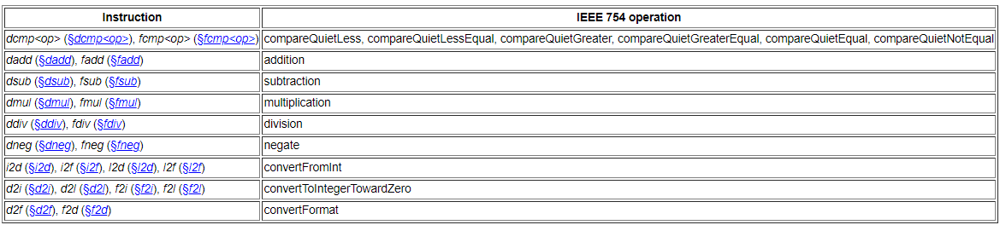

## 2.7. 对象的表示Representation of Objects
Java虚拟机不要求对象具有任何特定的内部结构。

在一些Oracle的Java虚拟机实现中，对类实例的引用是指向句柄的指针，句柄本身是一对指针:一个指向包含对象方法的表，一个指向表示对象类型的class对象的指针，另一个指向从堆中为对象数据分配的内存

## 2.8. 浮点算术Floating-Point Arithmetic
Java虚拟机包含了IEEE 754标准(JLS§1.7)中指定的浮点算法的子集。

在Java SE 15及更高版本中，Java虚拟机使用IEEE 754标准的2019版本。在Java SE 15之前，Java虚拟机使用1985版的IEEE 754标准，其中binary32格式被称为单格式，binary64格式被称为双格式。

许多用于算术(第2.11.3节)和类型转换(第2.11.4节)的Java虚拟机指令都使用浮点数。除了下面描述的某些指令外，这些指令通常对应于IEEE 754操作(表2.8-A)。
表2.8.与IEEE 754操作的对应

Java虚拟机和IEEE 754标准支持的浮点运算之间的主要区别是:

浮点余数指令drem(§drem)和frem(§frem)不对应于IEEE 754的余数操作。该指令基于使用向零舍入策略的隐含除法;IEEE 754的余数是基于使用四舍五入策略的隐含除法。(舍入策略将在下文讨论。)

浮点否定指令dneg(§dneg)和fneg(§fneg)并不精确地对应于IEEE 754的否定操作。特别是，这些指令不要求NaN操作数的符号位反转。

Java虚拟机的浮点指令不会抛出异常、陷阱或发出IEEE 754异常条件的信号，如无效操作、除零、溢出、下溢或不精确。

Java虚拟机不支持IEEE 754信令浮点比较，也没有信令NaN值。

IEEE 754包含与Java虚拟机中的舍入策略不对应的舍入方向属性。Java虚拟机不提供任何方法来更改给定浮点指令所使用的舍入策略。

Java虚拟机不支持IEEE 754定义的binary32扩展和binary64扩展浮点格式。在操作或存储浮点值时，不能使用超出浮点型和双精度型指定的扩展范围和扩展精度。

一些在Java虚拟机中没有相应指令的IEEE 754操作是通过Math和StrictMath类中的方法提供的，包括用于IEEE 754平方根操作的sqrt方法，用于IEEE 754 fusedMultiplyAdd操作的fma方法，以及用于IEEE 754余数操作的ieeeremander方法。

Java虚拟机需要支持IEEE 754次正规浮点数和逐渐下流，这使得证明特定数值算法的理想特性变得更加容易。

浮点算术是实算术的近似值。实数有无限个，而特定的浮点格式只有有限个值。在Java虚拟机中，舍入策略是一个函数，用于以给定格式从实数映射到浮点值。对于浮点格式可表示范围内的实数，实数线的连续段被映射为单个浮点值。将数值与浮点值相等的实数映射到该浮点值;例如，实数1.5被映射为给定格式的浮点数1.5。Java虚拟机定义了两个舍入策略，如下所示:

四舍五入策略适用于所有浮点指令，但(i)转换为整数值和(ii)余数除外。在四舍五入策略下，不精确结果必须四舍五入到最接近无限精确结果的可表示值;如果两个最近的可表示值相等，则选择其最低有效位为零的值。

四舍五入策略对应于IEEE 754中二进制算法的默认四舍五入方向属性roundTiesToEven。

roundTiesToEven舍入方向属性在1985版的IEEE 754标准中被称为“舍入到最接近”的舍入模式。Java虚拟机中的舍入策略以这种舍入模式命名。

向零舍入策略适用于(i)通过d2i、d2l、f2i和f2l指令(§d2i、§d2l、§f2i、§f2l)将浮点值转换为整数值，以及(ii)浮点余数指令drem和frem(§drem、§frem)。在向零舍入策略下，不精确的结果将被舍入到最接近的可表示值，该值的大小不大于无限精确的结果。对于转换为整数，向零四舍五入策略相当于截断，其中小数有效位被丢弃。

向零舍入策略对应于IEEE 754中二进制算法的roundTowardZero舍入方向属性。

roundTowardZero舍入方向属性在1985版的IEEE 754标准中被称为“舍入到零”舍入模式。Java虚拟机中的舍入策略以这种舍入模式命名。

Java虚拟机要求每个浮点指令将其浮点结果舍入到结果精度。每条指令使用的舍入策略要么四舍五入到最接近，要么四舍五入到零，如上所述。

Java 1.0和1.1要求严格计算浮点表达式。严格的求值意味着每个浮点数操作数对应一个可以用IEEE 754 binary32格式表示的值，每个双操作数对应一个可以用IEEE 754 binary64格式表示的值，每个具有相应IEEE 754操作的浮点运算符匹配相同操作数的IEEE 754结果。

严格的评估提供了可预测的结果，但是在Java 1.0/1.1时代常见的一些处理器家族的Java虚拟机实现中会导致性能问题。因此，从Java 1.2到Java SE 16, Java SE平台允许Java虚拟机实现与每个浮点类型关联一个或两个值集。float类型与float值集和float扩展指数值集相关联，而double类型与double值集和double扩展指数值集相关联。浮点值集对应于IEEE 754 binary32格式中可表示的值;浮点扩展指数值集具有相同的精度位数，但指数范围更大。类似地，双精度值集对应于IEEE 754 binary64格式中可表示的值;双扩展指数值集具有相同的精度位数，但指数范围更大。默认情况下允许使用扩展指数值集可以改善某些处理器系列上的性能问题。

为了兼容性，Java 1.2允许类文件禁止实现使用扩展指数值集。类文件通过在方法声明上设置ACC_STRICT标志来表达这一点。ACC_STRICT约束了方法指令的浮点语义，对浮点操作数使用浮点值集，对双精度操作数使用双精度值集，确保这些指令的结果是完全可预测的。因此，标记为ACC_STRICT的方法具有与Java 1.0和1.1中指定的相同的浮点语义。

在Java SE 17及以后的版本中，Java SE平台总是要求对浮点表达式进行严格的求值。在实现严格求值时出现性能问题的处理器家族的新成员不再有这种困难。该规范不再将float和double与上面描述的四个值集关联，ACC_STRICT标志不再影响浮点操作的求值。为了兼容性，在主版本号为46-60的类文件中，指定用来表示ACC_STRICT的位模式在主版本号大于60的类文件中是未指定的(即不表示任何标志)(§4.6)。Java虚拟机的未来版本可能会在未来的类文件中为位模式赋予不同的含义。